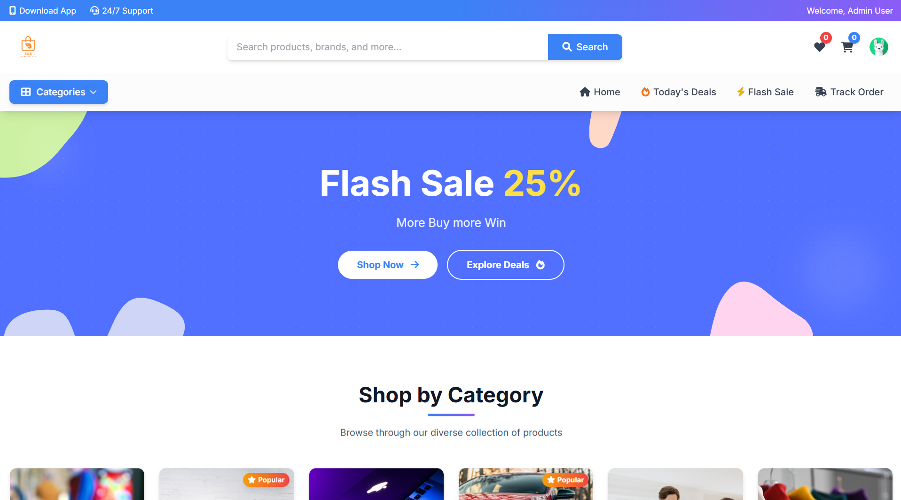

# 🛒 R&S Marketplace - E-Commerce Platform


A comprehensive, modern e-commerce marketplace built with Laravel 11 and Tailwind CSS. Features a powerful admin panel, user-friendly shopping experience, and robust backend functionality.

---

## 📋 Table of Contents

-   [Features](#-features)
-   [User Roles](#-user-roles)
-   [Requirements](#-requirements)
-   [Installation Guide](#-installation-guide)
-   [How to Run the Project](#-how-to-run-the-project)
-   [Database Setup](#-database-setup)
-   [Login Credentials](#-login-credentials)
-   [How the Project Works](#-how-the-project-works)
-   [Common Issues & Solutions](#-common-issues--solutions)
-   [Project Structure](#-project-structure)
-   [Technology Stack](#-technology-stack)
-   [Support](#-support)

---

## 🎯 Features

### 🛍️ **Customer Features**

-   ✅ User Registration & Login
-   ✅ Browse Products with Categories & Subcategories
-   ✅ Advanced Search with Filters (Price Range, Categories)
-   ✅ Shopping Cart Management
-   ✅ Wishlist Functionality
-   ✅ Multiple Address Management (District, Upazila, Union)
-   ✅ Order Placement & Tracking
-   ✅ Product Reviews & Ratings
-   ✅ Responsive Design (Mobile, Tablet, Desktop)
-   ✅ Dynamic Hero Banners

### 👨‍💼 **Admin Features**

-   ✅ Complete Dashboard with Statistics
-   ✅ Product Management (CRUD)
-   ✅ Category & Brand Management
-   ✅ Order Management & Status Updates
-   ✅ User Management
-   ✅ Hero Section Control
-   ✅ Review Moderation
-   ✅ Reports & Analytics

---

## 👥 User Roles

This project has **2 main user roles**:

### 1. **ADMIN**

-   Full access to admin panel
-   Manage products, categories, brands
-   Process orders and update status
-   Manage users and permissions
-   Control website content (hero sections)
-   View analytics and reports

### 2. **CUSTOMER**

-   Browse and search products
-   Add items to cart and wishlist
-   Place and track orders
-   Manage profile and addresses
-   Write product reviews
-   View order history

---

## 📦 Requirements

Before installation, ensure you have:

-   **PHP** >= 8.2
-   **Composer** (Latest version)
-   **MySQL** >= 5.7 or **MariaDB** >= 10.3
-   **Node.js & NPM** (for frontend assets)
-   **Git** (optional, for cloning)

---

## 🚀 Installation Guide

### Step 1: Clone or Download the Project

```bash
# If you have Git installed
git clone https://github.com/yourusername/R-S-Marketplace.git
cd R-S-Marketplace

# Or download ZIP and extract it
```

### Step 2: Install Composer Dependencies

```bash
composer install
```

**⚠️ Common Issue:** If `composer install` fails, try:

```bash
composer install --ignore-platform-reqs
# or
composer update
```

### Step 3: Install NPM Dependencies (Optional, for development)

```bash
npm install
npm run build
```

### Step 4: Create Environment File

```bash
# Windows
copy .env.example .env

# Linux/Mac
cp .env.example .env
```

### Step 5: Generate Application Key

```bash
php artisan key:generate
```

### Step 6: Configure Database

Open `.env` file and update database settings:

```env
DB_CONNECTION=mysql
DB_HOST=127.0.0.1
DB_PORT=3306
DB_DATABASE=marketplace_db
DB_USERNAME=root
DB_PASSWORD=your_password
```

**📝 Note:** Create the database first in phpMyAdmin or MySQL:

```sql
CREATE DATABASE marketplace_db;
```

### Step 7: Create Storage Link

```bash
php artisan storage:link
```

This creates a symbolic link for public file access.

---

## 💾 Database Setup

### Step 1: Run Migrations

```bash
php artisan migrate
```

This creates all necessary database tables.

**⚠️ Common Issue:** If migration fails:

-   Check database credentials in `.env`
-   Ensure MySQL server is running
-   Verify database exists
-   Try: `php artisan migrate:fresh`

### Step 2: Seed the Database

```bash
php artisan db:seed
```

This will create:

-   ✅ Admin user account
-   ✅ Customer user account
-   ✅ Sample products
-   ✅ Categories and brands
-   ✅ Bangladesh location data (Districts, Upazilas, Unions)
-   ✅ Hero sections
-   ✅ Product reviews

**💡 Tip:** To reset and reseed everything:

```bash
php artisan migrate:fresh --seed
```

---

## 🏃 How to Run the Project

### Option 1: Using PHP Built-in Server (Recommended for Development)

```bash
php artisan serve
```

The application will be available at: **http://127.0.0.1:8000**

### Option 2: Using Custom Port

```bash
php artisan serve --port=8080
```

Access at: **http://127.0.0.1:8080**

### Option 3: Using Laravel Herd or Valet (Mac/Windows)

If you have Laravel Herd or Valet installed, just open:

```
http://r-s-marketplace.test
```

### Option 4: Using XAMPP/WAMP/MAMP

1. Move project folder to `htdocs` (XAMPP) or `www` (WAMP)
2. Configure virtual host or access via: `http://localhost/R-S-Marketplace/public`

---

## 🔐 Login Credentials

### Admin Access

**URL:** `http://127.0.0.1:8000/admin/login`

```
Email: admin@marketplace.com
Password: admin123
```

**Admin Capabilities:**

1. Access admin dashboard
2. Manage all products (Create, Edit, Delete)
3. Manage categories and brands
4. Process customer orders
5. Update hero sections
6. View analytics and reports

### Customer Access

**URL:** `http://127.0.0.1:8000/login`

```
Email: customer@example.com
Password: customer123
```

**Customer Capabilities:**

1. Browse and search products
2. Add items to cart
3. Place orders
4. Manage wishlist
5. Save multiple addresses
6. Write product reviews
7. Track order history

---

## 🔄 How the Project Works

### Customer Flow:

```
1. Customer Registration/Login
   ↓
2. Browse Products by Category or Search
   ↓
3. View Product Details
   ↓
4. Add to Cart or Wishlist
   ↓
5. Proceed to Checkout
   ↓
6. Select/Add Delivery Address
   ↓
7. Place Order
   ↓
8. Track Order Status
   ↓
9. Write Product Review (after delivery)
```

### Admin Flow:

```
1. Admin Login
   ↓
2. View Dashboard Statistics
   ↓
3. Manage Products/Categories/Brands
   ↓
4. Receive New Orders
   ↓
5. Update Order Status (Processing → Shipped → Delivered)
   ↓
6. Moderate Reviews
   ↓
7. Manage Users
   ↓
8. Update Website Content (Hero Sections)
```

---

## Common Issues & Solutions

### 1. **"500 Internal Server Error"**

**Solution:**

```bash
php artisan config:clear
php artisan cache:clear
php artisan route:clear
php artisan view:clear
```

### 2. **"Class not found" or Composer Errors**

**Solution:**

```bash
composer dump-autoload
php artisan optimize:clear
```

### 3. **Images Not Displaying**

**Solution:**

```bash
php artisan storage:link
# Ensure public/storage folder exists
```

### 4. **Database Connection Failed**

**Solution:**

-   Verify `.env` database credentials
-   Ensure MySQL is running
-   Check if database exists:
    ```sql
    CREATE DATABASE marketplace_db;
    ```

### 5. **Permission Denied (Linux/Mac)**

**Solution:**

```bash
chmod -R 775 storage bootstrap/cache
chown -R www-data:www-data storage bootstrap/cache
```

### 6. **Migration Already Exists**

**Solution:**

```bash
# Reset and remigrate
php artisan migrate:fresh --seed
```

### 7. **Seeder Class Not Found**

**Solution:**

```bash
composer dump-autoload
php artisan db:seed
```

### 8. **Port Already in Use**

**Solution:**

```bash
# Use different port
php artisan serve --port=8080
```

### 9. **NPM Build Errors**

**Solution:**

```bash
rm -rf node_modules package-lock.json
npm install
npm run build
```

### 10. **Session/CSRF Token Mismatch**

**Solution:**

```bash
php artisan session:table
php artisan migrate
php artisan config:clear
```

---

## 📁 Project Structure

```
R-S-Marketplace/
├── app/
│   ├── Http/
│   │   └── Controllers/
│   │       ├── Admin/          # Admin panel controllers
│   │       └── HomeController.php
│   ├── Models/                 # Eloquent models
│   └── Providers/
├── database/
│   ├── migrations/             # Database schema
│   └── seeders/                # Data seeders
├── public/
│   ├── storage/                # Uploaded files (symlink)
│   └── images/                 # Static images
├── resources/
│   ├── views/
│   │   ├── frontend_view/      # Customer pages
│   │   └── backend_panel_view/ # Admin panel
│   ├── css/
│   └── js/
├── routes/
│   └── web.php                 # Application routes
├── storage/
│   └── app/public/             # File storage
├── .env                        # Environment config
├── composer.json               # PHP dependencies
└── package.json                # Node dependencies
```

---

## 🛠️ Technology Stack

**Backend:**

-   Laravel 11.x
-   PHP 8.2+
-   MySQL Database
-   Eloquent ORM

**Frontend:**

-   Blade Templates
-   Tailwind CSS
-   JavaScript/jQuery
-   AJAX

**Admin Panel:**

-   AdminLTE Theme
-   DataTables
-   Chart.js

---

## 📸 Screenshots (Optional)

Add screenshots here:

-   Homepage

    

-   Product Listing
-   Admin Dashboard
-   Cart Page

---

## 🎓 For Developers

### Quick Development Setup

```bash
# Complete setup in one go
composer install && \
cp .env.example .env && \
php artisan key:generate && \
php artisan storage:link && \
php artisan migrate:fresh --seed && \
php artisan serve
```

### Available Artisan Commands

```bash
# Clear all caches
php artisan optimize:clear

# Create new controller
php artisan make:controller ProductController

# Create new model with migration
php artisan make:model Product -m

# Create new seeder
php artisan make:seeder ProductSeeder

# Run specific seeder
php artisan db:seed --class=ProductSeeder
```

---

## 🤝 Support

If you encounter any issues:

1. Check the [Common Issues](#common-issues--solutions) section
2. Verify all [Requirements](#-requirements) are met
3. Ensure database is properly configured
4. Try clearing all caches: `php artisan optimize:clear`

---

## 📄 License

This project is open-sourced software licensed under the [MIT license](https://opensource.org/licenses/MIT).

---

## 🌟 Key Features Summary

✨ **Multi-user System** (Admin + Customer)  
✨ **Complete E-commerce Flow**  
✨ **Bangladesh Location Data**  
✨ **Responsive Design**  
✨ **Advanced Search & Filters**  
✨ **Shopping Cart & Wishlist**  
✨ **Order Management**  
✨ **Product Reviews**  
✨ **Admin Dashboard**  
✨ **Image Upload System**

---

**🚀 Happy Coding!**

For any questions or customizations, feel free to reach out!
